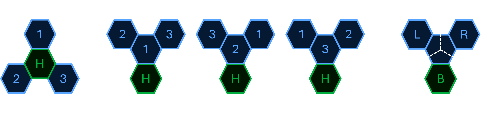
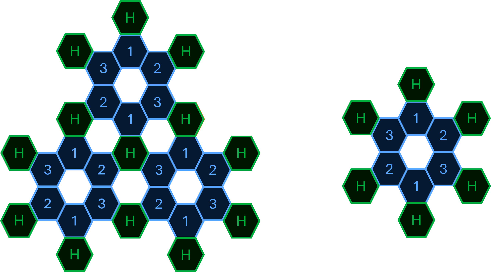
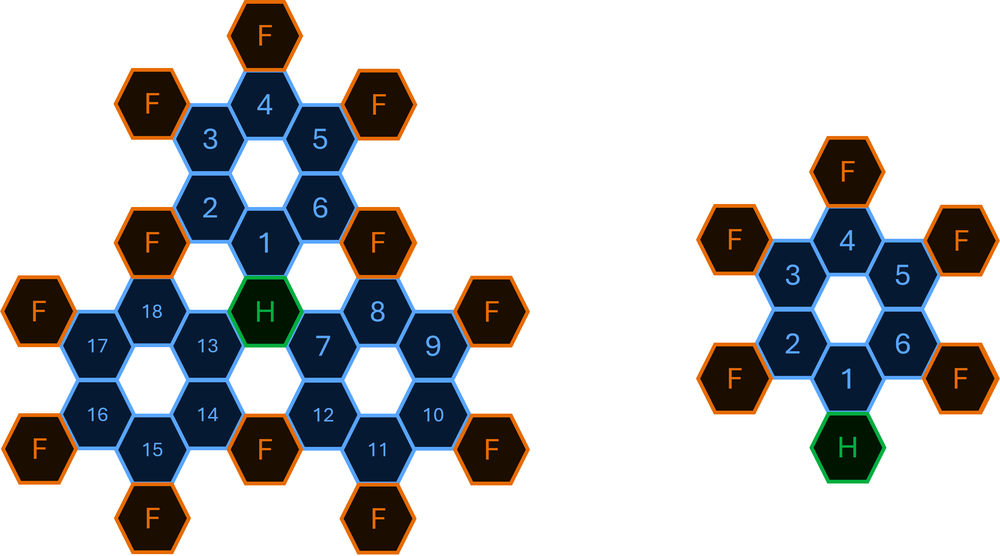
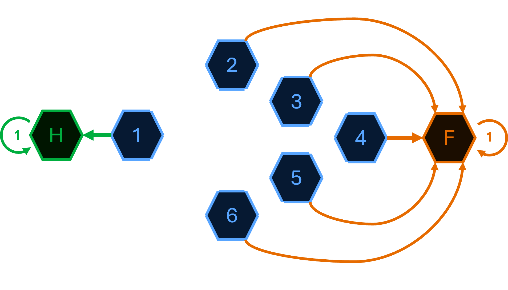

# Andy's Afternoon Amble
### The Truncated Tetrahedron

After labelling the 4 hexagonal faces of the truncated tetrahedron (*his home H, and the 3 other faces labelled as 1, 2, and 3*) and unfolding its surface onto the plane, we obtain the diagrams shown below.

<p align="center">
  
</p>

From these figures, we can construct a diagram describing all possible moves and destinations depending on Andy's path. We can restrict our analysis to a single branch, as the 3 branch only differ by a rotation.

<p align="center">
  
</p>

Andy returns to the starting face of the truncated tetrahedron whenever one of the following two conditions is met:
- He moves backward to  his home again;
- He repeats the same move as his initial move.

> For example, after leaving his home, if his first move is to the left, he may perform any number of right turns, but his exploration ends as soon as he turns left again.

<br/>

---
### The Kitchen Hexagonal Tiling

Once projected onto the kitchen tiling, the only way for Andy to realize that he has left his original world is to reach a tile where he should have returned to his home (*these tiles are labelled F*). In contrast, revisiting his home does not reveal that he has left the truncated tetrahedron.

<p align="center">
  
</p>

The problem can therefore be modelled as an absorbing Markov chain with two absorbing states:
- $H$, representing the home tile;
- $F$, representing all tiles where Andy realizes that he is no longer on the truncated tetrahedron.

<p align="center">
  
</p>

<br/>

Let $u_i$ denote the probability of eventually reaching $F$ when starting from state $i$. By definition,
- $u_H = 0$, since starting from the absorbing state $H$ means that reaching $F$ is impossible;
- $u_F = 1$, since $F$ has already been reached.

The remaining states satisfy the system :

$$ \begin{cases}
  u_{1}=\frac{1}{3}\times(u_{2}+u_{6}+u_{H}) \\
  u_{2}=\frac{1}{3}\times(u_{1}+u_{3}+u_{F}) \\
  u_{3}=\frac{1}{3}\times(u_{2}+u_{4}+u_{F}) \\
  u_{4}=\frac{1}{3}\times(u_{3}+u_{5}+u_{F}) \\
  u_{5}=\frac{1}{3}\times(u_{4}+u_{6}+u_{F}) \\
  u_{6}=\frac{1}{3}\times(u_{5}+u_{1}+u_{F})
  \end{cases}\quad  \Leftrightarrow \quad \begin{cases}
  u_{1}=\frac{11}{20} \\
  u_{2}=\frac{33}{40} \\
  u_{3}=\frac{37}{40} \\
  u_{4}=\frac{19}{20} \\
  u_{5}=\frac{37}{40} \\
  u_{6}=\frac{33}{40}
  \end{cases}$$

As expected, the farther the initial state lies from the starting tile, the greater the probability that Andy discovers he is no longer walking on the truncated tetrahedron. Since Andy begins his walk from state $1$, the probability that he eventually realizes he has left the truncated tetrahedron is :

$$ u_1=\frac{11}{20}=0.55 $$

<br/>

---
### Monte Carlo Simulation

Finally, we can use a Monte Carlo simulation to provide an empirical validation of the Markov chain model.

``` python
import random

moves = {1:[2,6,'H'], 2:[1,3,'F'], 3:[2,4,'F'], 
         4:[3,5,'F'], 5:[4,6,'F'], 6:[5,1,'F']}

def random_walk(position):
    while True:
        choices  = moves[position]
        position = random.choice(choices)
        
        if position == 'H':
            return 0
        
        if position == 'F':
            return 1

N = 50000
start = 1
success = sum(random_walk(start) for _ in range(N))

print(f"Monte Carlo Simulation (N={N}): {success/N:.4f}")
```

``` text
Monte Carlo Simulation (N=50000): 0.5502
```